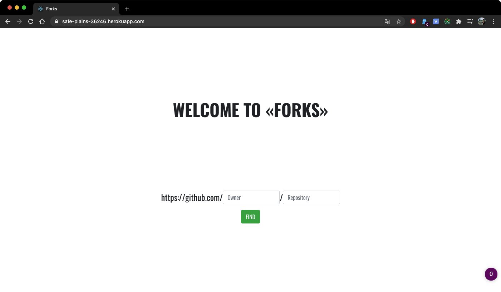
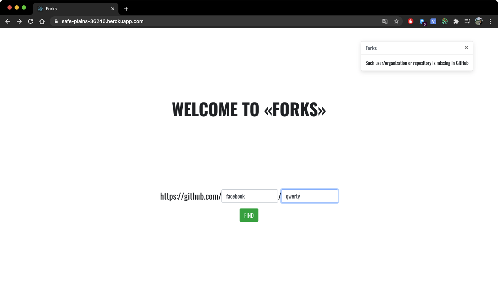
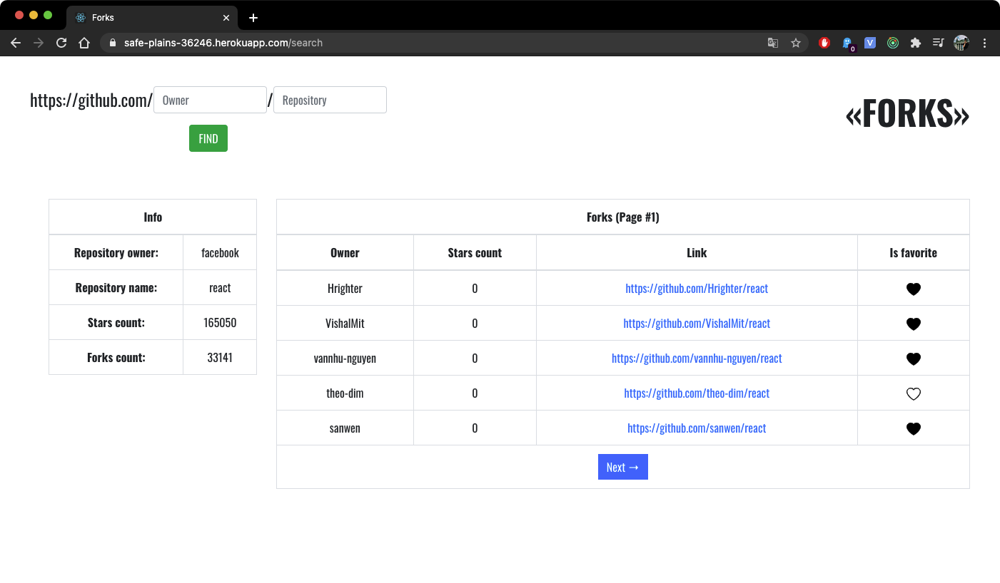
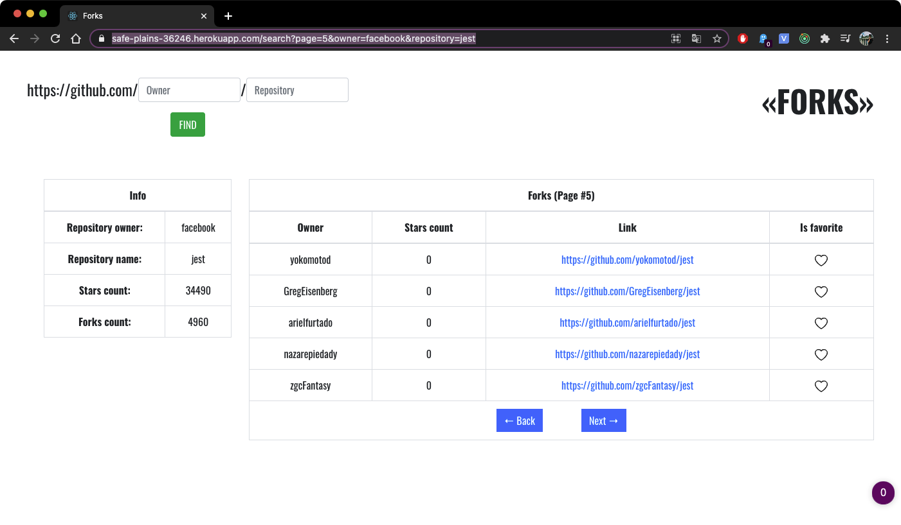
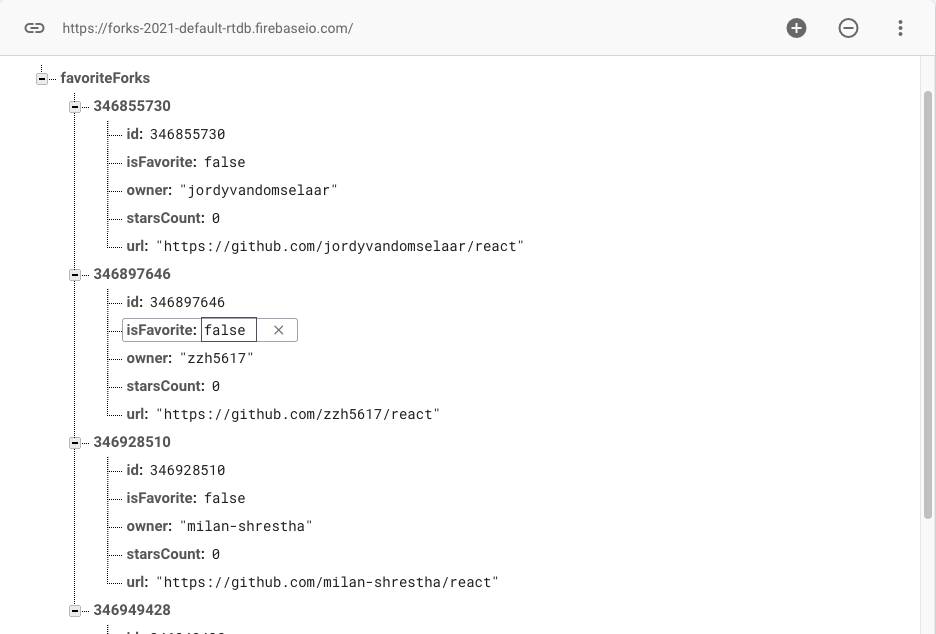

# App to analyze GitHub repositories and its' forks

## «Forks» – it's an application, that can find any repository, show it's name, owner, count of stars, show all forks and their count. You can add any fork to *favorites* - all favorite forks are storing in [firebase realtime database](https://firebase.google.com/)

- Application available in Heroku: <https://safe-plains-36246.herokuapp.com/>

- You can also run application with npm: clone the repository and run:

```cmd
cd forks
npm start
```

## **Screenshots**

- *Main page*


- *Main page with missing repository searched*


- *Search page*


### You also can make requests with url parameters (e.g. */search?page=5&owner=facebook&repository=jest*)



- *Favorites in database*

